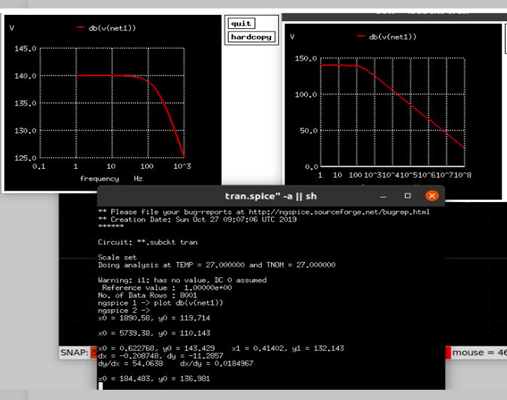

# Polysilicon Resistor Based Temperature Sensor

Polysilicon Resistor Based Temperature Sensor IC Design - A submission to the [IEEE SSCS PICO Design Contest 2021](https://sscs.ieee.org/about/solid-state-circuits-directions/sscs-pico-design-contest)

## Project Lead:

Dr. J. Dhurga Devi, Assistant Professor, Dept. of ECE, CEG Campus, Anna University.

### Undergrad Students:

#### Third Year:
- Keerthana Rajeswari
- Vasanth Kumar V

#### Fourth Year:
- Rahul R Bharadwaj
- Arunachalam S
- Narenthiran M
- Harikailash S

## List of Contents:
1. Objectives
2. Target Specifications
3. System Functional Description
4. Repository Organisation
5. System functional block level simulation results
6. Closed Loop Simulation
7. Summary of the present status

## 1. Objective :
To design a temperature sensor and its read out electronics meeting a required temperature range and accuracy.

## 2. Target Specifications:

| Parameter | Specification  |
|:---:|:---:|
| Temperature range and accuracy  | - 35°C to +125°C  |
| Inaccuracy  | < ± 0.15°C |
| Readout | 20 bits |
| Clock for readout  | 32 kHz  |
| WB Nominal Input Frequency | 250 kHz |
| VCO Nominal Frequency | 1 MHz |
| Process Used | 0.13µm SKY130A |

## 3. System Functional Description:

Design of the temperature sensor is based on the below literature:

[1] P. Park, D. Ruffieux and K. A. A. Makinwa, "A Thermistor-Based Temperature Sensor for a Real-Time Clock With ± 2 ppm Frequency Stability," in *IEEE Journal of Solid-State Circuits*, vol. 50, no. 7, pp. 1571-1580, July 2015, [doi: 10.1109/JSSC.2015.2417806](https://ieeexplore.ieee.org/document/7089311).

Functional block diagram of the system is given below:

Fig. 0 Functional Block Diagram

Functionality of the individual blocks are verified. Simulation results of individual blocks are
given below:

## 4. Repository Organisation

This repository contains the folders listed below.

- `Schematics` - Contains the `xschem` schematics of the modules.
- `prelayout simulations` - Contains the `xschem+ngspice` based simulation setup.
- `layout` - Contains the flattened `magic` files of the layout of individual blocks.
- `lvs` - Contains the Layout Versus Schematic (LVS) setup and output of certain blocks.
- `postlayout simulations` - Contains the RC extracted spice files (from `magic`) and simulation setup.
- `closed loop Simulation schematic` - Contains the complete FLL schematic.
- `closed_loop_symbol_view_simulation` - Contains the complete FLL schematic + simulation.

## 5. System Functional Block Level Simulation Results

### (i) Wein Bridge:
Component values are chosen for a resonant frequency of **250kHz**. The value of resistance Rwb is used as 135kΩ and Capacitor Cwb is 4.7pF. 

The schematic diagram of Wein Bridge is given in the below Fig.1a. Circuit component details, layout details and charaterization of Wein Bridge functionality at extreme temperatures and under process corners are described below:

#### (a) Circuit Details :
Polysilicon Resistor used is `res_xhigh_po_0p35` whose resistance is of `2kΩ/square`. The capacitor used is `cap_mim_m3_1`, the capacitance between metal 4 and metal 3. The capacitance defined by the process is `2.2fF/µm^2`. Dimensions used are given in the table below:

Table 1a: Component values of Wein Bridge

| Component  | Value  |  W (µm)  | L (µm)  | Multiplication factor (MF) |
|:---:|:---:|:---:|:---:|:---:|
| `res_xhigh_po_0p35` | 135 kΩ | 23.625 | 0.35 | - |
| `cap_mim_m3_1` | 4.7 pF | 24 | 24.1 | 4 |

Fig 1a Circuit Schematic of Wein Bridge

The resistance of the polysilicon resistor is characterized as a function of temperature and under process corners. The characteristics at nominal process is shown in Fig. 1b. With process corners, the resonant frequencies are extracted from the transfer characteristics of the bridge using an AC analysis. Plots of Resistance vs Temperature and transfer functions for two process corners are given Fig.1b,c,d and e and a sµmmary of the resonant frequencies under various process corners is provided in the Table 1b.

Fig. 1b Variation of R with Temperature

Fig. 1c Transfer function (Magnitude) of Wein Bridge at HH process corner at -35°C

Fig. 1c Transfer function (Phase) of Wein Bridge at HH process corner at -35°C

#### (b) Characteristic under LL process corner:

Fig. 1d Variation of R with Temperature at LL process corner

Fig. 1c Transfer function (Magnitude) of Wein Bridge at LL process corner at -35°C

Fig. 1c Transfer function (Phase) of Wein Bridge at LL process corner at -35°C

Similar characteristics are extracted under process combinations hl and lh and at extreme temperatures. The resonant frequency of the bridge at extreme temperatures and at room temperature are shown in Table 1b.

Table 1b. Resonant frequencies across process corners and at extreme temepratures
Resonant Frequency (in kHz)@ 
|Corner|-35°C|27°C|125°C|
|:---:|:---:|:---:|:---:|
| tt | 224.91 | 247.742 | 280.5434 |
| ll | 276 | 304.1 | 344.5 |
| hh | 186.21 | 206.445 | 232.27 |
| hl | 237.137 | 261.216 | 295.8 |
| lh | 216.77 | 238.781 | 270.4 |

The tabulation shows a worst case deviation of 64kHz from its nominal resonant frequency.

#### (c) Layout Details of Wein Bridge:

The resistors are realized as a single strip of polysilicon material. 16 Dummies are used around the resistors. Metals M1 to M2 are used for routing. 

For capacitor realization a common centroid approach is used to place capacitors. 1.17pF capacitor is considered as an unit capacitor to realize 4.7pF. 16 Dummies are used around. Routing is carried out using M1 to M4 metals.

Post layout simulations of the constructed Wein bridge are given in Fig.1f below:

Fig.1f Post layout Simulation of transfer function (magnitude) of Wein Bridge

Fig.1f Post layout Simulation of transfer function (phase) of Wein Bridge

The report showing resonant frequency of Analysis is shown in Fig. 1g.

Fig. 1g Report showing Resonant frequency extracted from AC analysis.

The centre frequency of the Wein Bridge in post layout simulation at room temperature is found to be 210.8628 kHz showing a deviation of 39.137 kHz from the required resonant frequency of 250 kHz.

#### (d) Pending Task: 

At extreme temperatures and process corners, postlayout simulations and characterization of the bridge are yet to be carried out.

### (ii) Current Buffer

Functionality of current buffer used is a chopper based regulated low voltage swing cascode current buffer as realized in [1]. The circuit schematic of the current buffer integrated with chopper is shown in Fig. 2a. Chopper here plays the dual role of mixing operation and upconversion of flicker noise.

The current buffer used is of cascode low voltage swing topology with gain boosting amplifiers
to improve its input and output impedance. Four choppers are used CHA1, CHA2, CHPD and CHPU. CHA1, CHA2 plays the role of mixer and for upconversion of flicker noise from the current source, whereas while chopping action is carried out CHPU and CHPD are meant for maintaining
the terminal polarity of the gain boosting amplifiers for negative feedback action.

Circuit component details, layout details and charaterization of chopper integrated current buffer functionality at extreme temperatures and under process corners are described below:

Fig. 2a Circuit schematic of the current buffer integrated with chopper

#### (a) Circuit Component Details:
Circuit is designed for the Specifications given in Table 2a and component details are Table 2b.

Table 2a. Specifications
| Parameters  | Value |
|:---:|:---:|
| Bias Current | 3 µA |
| Maximum Input Current Amplitude (@Resonance) | 2.5 µA |
| Pull-Up Amplifier Gain | 33 dB |
| Pull-Down Amplifier Gain | 28 dB | 

Device Dimesions, Resistor values and Bias voltages used in the cascode current buffer circuit,
pull down amplifier, pull up amplifier and chopper circuit are shown in Fig. 2b,c,d &f. Their
respective component values are given in Table 2b.

Fig. 2b Circuit Schematic of low voltage swing cascode current Buffer

Fig. 2c Circuit Schematic of gain boosting amplifier in pull down path

Fig. 2d Circuit Schematic of gain boosting amplifier in pull up path

Fig. 2e Circuit Schematic of chopper

Table 2b: Component values of Chopper based Current Buffer
| Module  | Circuit Component  | Value  |
|:-:|:-:|:-:|
| Cascode  | M1a  | W/L=1/2  |
| Low  | M2a  | W/L=12/1  |
| Voltage  | M3a  | W/L=10/1  |
| Swing  | M4a  | W/L=5/1  |
| Current  | R1a  | 55 kΩ  |
| Buffer  | R2a  | 110 kΩ |
|   | Vbp1  | 0.8 V |
| Gain  | Mpdn1a  | W/L=36/1  |
| Boosting | Mpdn2a  | W/L=5/2  |
| Amplifier  | Rpdn2a  | 330 kΩ |
| in Pull  | Rpdn1a  | 165 kΩ |
| Down  | Vbp2  | 1.08 V  |
| Gain  | Mpup1b  | W/L=1/4  |
| Boosting  | Mpup2a  | W/L=10/1  |
| Amplifier  | Rpup2a  | 165 kΩ |
| in Pull-Up  | Vbn1  | 0.561 V  |
| Chopper  | Mchn1  | W/L=1/0.15  |
|   |  Mchp1 | W/L=1/0.15  |

#### (b) Layout Details
Unit resistor chosen for realization is 110 kΩ and all other resistors in the current buffer are
derived using combinations of this unit resistor. The dimension W/L for 110 kΩ resistor turns out to be 19.25µm/0.35µm. Common centroid method is employed for placing the resistors and 22
dummies are placed around. Metals M1 to M3 are used for routing. Dummies are placed for
NMOS and PMOS transistors of cascode current buffer and amplifier stages.

#### (c) Postlayout Simulations
Postlayout simulations are carried out with an external input sinusoidal current source of
amplitude 2 µA at nominal resonant frequency of 250 kHz fed to common gate stage of cascode
current source and quadrature phase square waveform with respect to the current source , with
amplitude 1.8V , are fed to the chopper circuit. The simulations were carried out in room
temperature and under process corners. The resulting ouput current waveform is shown in the
Fig.2f.

Fig.2e. Output Current from Current Buffer

From the current waveform, it can be seen that output amplitude is approximately of 4 µA, and
hence shows buffer operation. The chopping operation is also evident from the reversal in the
polarity of the ouput current waveform.

#### (d) Pending Task: 
At extreme temperatures and process corners, postlayout simulations have to be carried out.

### (iii) Switched Capacitor Filter :
A low pass filter is designed to extract a DC voltage proportional to phase error resulting when the bridge is excited with a frequency other than the resonance condition. A switched capcitor filter with a sampling frequency twice that of the resonant frequency is used as in [1] , to minimize the effect of ripple resulting due to higher order even harmonics because of chopping operation. In order to realize twice the sampling rate the two parallel path switch capacitor filters operated with 180° phase shifted resonant frequency signal, when the first path operates in hold mode the other path will be in sampling mode and vice versa.

The circuit schematic of the time interleaved switch capcitor is shown in Fig.3a.
Component details and post layout simulations are given below:

Fig. 3a. Circuit schematic diagram of Switch Capacitor Filter

#### (a) Component details
The filter is designed for a cutoss frequency of 200Hz. Capacitor value used is 80pF which
realized using PMOSFET with source, drain and substrate terminals shorted together acts as one
terminal and gate acts as the other terminal.
Component values are shown in the below Table 3.

Table 3: Component values of Switch Capacitor Filter
| Component  | Value  |  W (µm)/L (µm)  | Multiplication factor (MF) |
|:---:|:---:|:---:|:---:|
| Mcap1 | 80 pF | 7/8 | 200 |
| Mn1 | - | 1/0.15 | - |
| Mp1 | - | 2/0.15 | - |

#### (b) Layout details
80pF capacitance in layout is realized using 20 fingers PMOS transistor with a multiplier of 20,
size of each transistor was chosen as 7/8. Local interconnect and metal 1 are used for routing.

#### (c) Postlayout Simulations
AC analysis was carried out using the postlayout netlist for determining the capacitance value and in this case the switch was considered to be an always on switch. AC analysis was carried out with an input ac current source and a shunt resistance of 10 MΩ was used to model the output
resistance of current buffer. The cut off frequency was observed to be 184 Hz and the capacitor
was found to be 84pF. Cutoff frequency was observed to match with prelayout simulations.The
bode plot obtained from pre and post layout simulations are shown in Figure 3b. From the figure it can be seen that prelayout simulation charcteristics matches with that of postlaout simulations.

Fig. 3b Pre and post layout simulations of lowpass filter

#### (d) Pending Task: 
At extreme temperatures and process corners, postlayout simulations have to be carried out.

### (iv) VCO
VCO is realized as a nine stage current starved ring oscillator similar to that in [1] except that the current source is presently being used without a source degeneration resistor. The circuit schematic of VCO is shown in Fig. 4a. The current source used in the ring oscillator is a control voltage dependent current source with the maximum current capability of 12µA. The transistors of the delay stages are sized such that the range of frequency obtained is ±200kHz from 1MHz which is based on Wein Bridge resonant condition for the temperature range of interest.

Fig. 4a. Circuit schematic of ring oscillator based VCO

#### (a) Component Details:
The delay element stages along with the current source is shown in Fig.4b. The device dimension
details are given in Table 4

Fig. 4b. Delay element stages

Table 4: Component values of VCO
| Devices  | W (µm)/L (µm)  |
|:-:|:-:|
| Mn1  | 1/1 |
| Mn2  | 7/8 |
| Mp1  | 0.55/4 |
| Mp2  | 1/1 |
| M1a  | 5/1 |

M1a is the switch used to force the transistor into oscillation state during power up. The switch is turned for a short duration of 100ns. The current that is drawn during this on duration turns out to be 23µA.

#### (b) Prelayout Simulation Results
Oscillation and the range of operating frequencies of VCO was verified in extreme temperature
and under process corners. The VCO gain characteristic is shown below. For extreme temperature
settings and under nominal process corners, the control voltage was varied in equal increments and the period was measured using `trig` command. Using the period information of VCO output
signal, frequencies obtained from VCO are plotted as a function of control voltage. 

Fig. 4c. VCO Gain characteristics

From the characteristics it can observed that VCO gain charcteristics meets the range of frequency variations required by Wein Bridge.

#### (c) Layout Details:
The cells are placed such that the metals takes shorter route between transistors. A decoupling capacitance of 20pF is used from the source node of current source to ground inorder to filter the supply noise about resonant frequency. PMOS type capacitor is used with 25 fingers and 2 multipliers of W/L equals 7/8 transistors. Presently LVS and postlayout simulations for VCO is under progress.

### (v) Divider
The divider is used for obtaining division factor of 4. An inphase and a quadrature phase divide by 4 signal are generated from VCO output signal. The block diagram is shown in Fig. 5a. This is realised by using master slave multiplexer based Flip Flop. Circuit schematic of the master slave flip flop is shown in the below figure Fig. 5b. Clear signal resets the state of the closed loop by breaking open the feedback loop and forcing the value to zero. This is carried out by means of a NOR operation.

Fig.5a Block diagram of Mux based static Flip Flop

Fig.5b Circuit Schematic diagram of Mux based static Flip Flop

Table 5: Component values of Flip Flop
| Devices  | W (µm)/L (µm)  |
|:-:|:-:|
| Mn1  | 1.68/0.15 |
| Mn2  | 1.68/0.15 |
| Mn3  | 1.68/0.15 |
| Mp1  | 0.42/0.15 |
| Mp2  | 0.42/0.15 |
| Mp3  | 0.42/0.15 |

#### (b) Simulation results
Simulation results will be discussed in closed loop simulation results section.

#### (c) Pending Task: 
At extreme temperatures and process corners, postlayout simulations have to be carried out.

### (vi) Edge Combiner
Edge combiner is realized using NAND gates that combines VCO outputs from each of its 9 delay
stages. Buffers are used to drive the edge combiner. The circuit schematic is shown in Fig. 6a.

Fig. 6a Circuit schematic of Edge combiner

#### (a) Component Details
The W/Ls of the NAND gate are chosen to have a delay matched with a reference inverter delay.
The dimensions are given in the Table 6.
| Devices  | W (µm)/L (µm)  |
|:-:|:-:|
| Mn1  | 0.74/0.15 |
| Mn2  | 3.24/0.15 |
| Mp1  | 1.68/0.15 |
| Mp2  | 1.68/0.15 |

#### (b) Simulation results
Combining the edges from the delay elements a 9 times frequency of VCO signal is generated and
the simulation results will be discussed in closed loop simulation results section.

#### (c) Pending Task: 
At extreme temperatures and process corners, postlayout simulations have to be carried out.

## 6. Closed Loop Simulations
Closed loop simulations and functionality verifications are carried out as below.

- [x] a) FLL integrated with edgecombiner at room temperature and at nominal process corners
- [x] b) FLL integrated with edgecombiner at -35°C and at nominal process corners
- [x] c) FLL integrated with edgecombiner at +85°C and at nominal process corners
- [x] d) FLL integrated with edgecombiner at -35°C and at SS corner
- [x] e) FLL integrated with edgecombiner at +85°C and at FF corner
- [x] f) FLL integrated with edgecombiner at -35°C and at hh corner (to take into account process
variation in polysilicon resistors)
- [x] g)FLL integrated with edgecombiner, 20 bit counter at room temperature and at nominal process
corners

Closed loop simulations are carried out using the circuit schematic diagram shown in Fig.7a Results of each of the settings mentioned above are explained below.

Fig.7a Closed loop Circuit schematic of FLL integrated with Edge combiner

### a) FLL integrated with edgecombiner at room temperature and at nominal process corners

Fig. 7b showing locking characteristics of control voltage, VCO and Divider output

The control voltage from Fig.7b. is of 730.7mV at nearly about 2.5 time constants(measured at
500µs from the above plot, loop bandwidth of the system is 5kHz) . This is then used in the VCO
test bench setup at room temperature, period and hence frequency of VCO output is measured.
This is shown in Fig.7c.

Fig.7c VCO test bench for measuring frequency at room temperature

Using the control voltage setting of 730.7mV, from the corresponding VCO output period is
measured using `trig` command. This is found to be 0.9491414µs and the corresponding frequency
is 1.05358379689MHz.

Fig. 7d shows VCO output, Inphase , Quadrature phase divide by 4 Output at room temperature

From the above Fig. 7d, under locked condition divide by 4 nature of inphase, quadrature phase
of the divider output signal can be observed.

Similar measurements are made at extreme temperatures at -35°C and at +85°C . The respective
plots, test bench setup are shown in the below section (b) and (c).

### b) FLL integrated with edge combiner at -35°C and at nominal process corners

Fig. 7e showing locking characteristics of control voltage, VCO and Divider output at -35°C

Fig.7f VCO test bench for measuring frequency at -35°C

The control voltage from Fig.7e. the control voltage is observed to be 813mV at -35°C . This is
used in VCO test bench setup at -35°C, period and hence frequency of VCO output is measured.
This is shown in Fig.7f. 
Period is measured to be 1.034826µs and the respective frequency measure is 966.34603305kHz.

Fig. 7g shows VCO output, Inphase , Quadrature phase divide by 4 Output and Edge combiner
output at -35°C.

From the above Fig. 7g. , under locked condition divide by 4 nature , inphase, quadrature phase of the divider output signal, edge combiner output can be observed. Edge combiner output can be
observed to be nine time the frequency of VCO signal (Fvco).

(c) FLL integrated with edgecombiner at +85°C and at nominal process corners

Fig.7h Locking characteristic of FLL at 85°C

Fig.7i VCO test bench for measuring frequency at 85°C

Fig. 7j shows VCO output, Inphase , Quadrature phase divide by 4 Output and Edge combiner output at 85°C

The control voltage from Fig.7h. the control voltage is observed to be 540mV at 85°C . This is
µsed in VCO test bench setup at 85°C, period and hence frequency of VCO output is measured.
This is shown in Fig.7f. Period is measured to be 0.9342804µs and the respective frequency
measure is 1.034826MHz.

These measurements from simulations show a 104ns difference in the time interval for a
temperature range of -35°C to 80°C. Similar measurements for time period of VCO output signal has been carried out under various process corners and at temperature extremes.

| Process  | Temperature  | Time Period (µs)  |
|:-:|:-:|:-:|
| hh  | -35°C  | 1.256651  |
| ss  | -35°C  | 1.111814  |
| ff  | +85°C  | 0.882471  |

A complete integration of the system with 20 bit counter is carried out and transitions in 13th bit was observed.

Complete floor plan of the temperature sensor is given below.

#### The temperature sensor circuit area was found to be **280µm^2**

## 7. Summary of the present status

- [x] All functional blocks layout is complete.
- [x] Postlayout simulation have to be carried out for 20bit counter and divider, rest of the blocks are verified.
- [ ] Temerature range and mapping to binary code and estimating the accuracy are to completed.